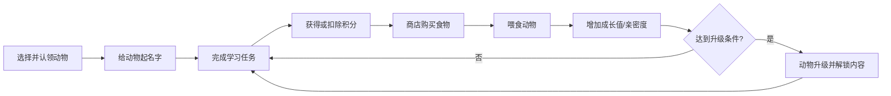

# 学习认领小动物小游戏设计方案

## 1. 项目定位

### 1.1 一句话定义

一款以“学习换积分、积分养动物、成长促坚持”为核心的网页养成小游戏。

### 1.2 目标用户

- 有轻量学习打卡需求的学生、考证人群、职场自学用户
- 喜欢宠物养成和正反馈机制的休闲用户
- 希望通过游戏化机制培养学习习惯的人群

### 1.3 设计目标

- 上手简单：3 分钟内完成认领并开始体验
- 正反馈强：每次学习都能立即看到动物成长
- 决策轻量：积分消费简单、目标明确
- 可持续扩展：后续可加入任务、装扮、社交分享

---

## 2. 世界观与主题

玩家进入“学习栖息地”，从待认领的小动物中选择一只作为学习伙伴。  
学习伙伴会因为玩家的学习状态而成长：学习越稳定，动物越健康、越活跃、形态越高级。

推荐基调：

- 情绪氛围：治愈、轻松、鼓励型
- 视觉风格：自然手账风 + 卡片式游戏 UI
- 关键词：认领、陪伴、成长、喂养、升级、坚持

---

## 3. 核心玩法机制

## 3.1 主循环

## 3.2 三个核心资源

### 积分 Points

- 来源：完成学习任务、连续打卡、阶段奖励
- 消耗：购买食物、特殊道具
- 扣减：未完成计划、连续中断、负向行为

### 成长值 Growth

- 通过喂食、互动、完成里程碑获得
- 是动物升级的主要指标

### 状态值 Mood / Satiety

- 可选机制，建议 MVP 先保留一个“饱腹度”
- 喂食后上升，长时间不互动可缓慢下降

---

## 4. 动物系统设计

## 4.1 初始动物推荐

建议首版选择 3 种风格明显的小动物：

- 仓鼠：可爱、亲和、成长反馈明显
- 小企鹅：稳定、努力、适合学习主题
- 小狐狸：聪明、灵动、成就感强

每只动物可有不同成长方向，但首版建议只做视觉差异，不做复杂数值差异，方便平衡。

## 4.2 动物成长阶段

推荐 3 个阶段：

- Lv.1 幼年期：刚认领，体型小，动作少
- Lv.2 成长期：解锁新动作与新表情
- Lv.3 成熟期：形态更完整，可解锁徽章或背景

## 4.3 升级条件示例

- Lv.1 → Lv.2：成长值达到 100
- Lv.2 → Lv.3：成长值达到 260
- 满足额外条件可选：
  - 连续学习 3 天
  - 累计完成 10 次学习记录

---

## 5. 学习与积分规则

## 5.1 学习任务类型

建议采用“轻任务 + 自定义时长”方式：

- 专注学习 25 分钟：+12 积分
- 专注学习 45 分钟：+20 积分
- 完成今日任务清单：+15 积分
- 连续打卡奖励：+5 / +10 / +15 积分递增

## 5.2 扣分机制

扣分不宜太强，避免挫败感。建议只做轻惩罚：

- 设定任务未完成：-5 积分
- 连续 2 天未学习：-8 积分
- 冲动消费导致余额不足：禁止购买，不额外扣分

## 5.3 鼓励机制

- 每日首次学习额外奖励：+5 积分
- 升级当日赠送免费食物包
- 连续学习天数形成 streak，提供额外奖励

---

## 6. 商店与食物系统

## 6.1 食物设计

建议首版食物只影响成长值，不做复杂属性组合。

| 食物 | 价格 | 成长值 | 说明 |
|---|---:|---:|---|
| 胡萝卜片 | 8 | +6 | 基础食物 |
| 坚果包 | 15 | +12 | 性价比高 |
| 小鱼干 | 25 | +22 | 稀有食物 |
| 能量果冻 | 40 | +38 | 升级冲刺用 |

## 6.2 购买与喂食流程

1. 玩家进入商店
2. 查看当前积分余额
3. 选择食物并购买
4. 食物进入背包
5. 在动物主页中选择喂食
6. 播放反馈动画，成长值增加

## 6.3 平衡建议

- 单次学习积分应能购买基础食物
- 高级食物应对应 2~3 次学习收益
- 升级所需成长值不宜过高，保证前 3 天可感知成长

---

## 7. 页面结构设计

## 7.1 页面清单

### 1）首页 Landing

目标：

- 解释“学习养成”核心玩法
- 引导开始认领

模块：

- 品牌标题与一句话介绍
- 动物展示区
- “立即认领我的学习伙伴”按钮

### 2）认领页 Adopt

目标：

- 选择动物
- 输入名字

模块：

- 动物卡片列表
- 命名输入框
- 确认认领按钮

### 3）动物主页 Pet Home

目标：

- 作为核心操作中心

模块：

- 动物立绘 / 动画区域
- 名字、等级、成长值、饱腹度
- 当前积分
- 快捷按钮：去学习 / 去商店 / 喂食 / 查看记录

### 4）学习页 Study

目标：

- 记录学习行为并结算积分

模块：

- 学习模式选择（25/45 分钟）
- 倒计时或手动打卡
- 完成/放弃按钮
- 本次积分结算

### 5）商店页 Shop

目标：

- 消费积分购买食物

模块：

- 食物列表
- 当前积分
- 购买确认弹窗

### 6）背包页 Inventory

目标：

- 管理已拥有的食物

模块：

- 食物库存
- 使用按钮

### 7）记录页 Record

目标：

- 展示学习与成长成果

模块：

- 学习历史
- 积分收支明细
- 升级记录
- 连续学习天数

---

## 8. 关键流程组织

## 8.1 新用户首次流程

1. 打开首页
2. 点击开始认领
3. 选择动物并输入名字
4. 进入动物主页
5. 系统引导去完成第一次学习
6. 获得初始积分
7. 去商店购买第一份食物
8. 完成第一次喂食
9. 看到成长值变化，形成正反馈

## 8.2 日常循环流程

1. 登录进入动物主页
2. 查看今日学习目标
3. 开始学习任务
4. 结算积分
5. 进入商店购买食物
6. 喂食并提高成长值
7. 达成升级后解锁新形态

## 8.3 失败与恢复流程

- 学习中断：提示“本次未完成，不获得积分”
- 积分不足：提示“再学习一次就可以买啦”
- 长时间未喂食：只影响状态提示，不阻止继续游玩
- 用户回流：展示“你的动物在等你回来学习”

---

## 9. 数值建议（MVP）

## 9.1 初始值

- 初始积分：20
- 初始成长值：0
- 初始等级：1
- 新手礼包：免费基础食物 x1

## 9.2 学习收益建议

| 行为 | 积分变化 |
|---|---:|
| 完成 25 分钟学习 | +12 |
| 完成 45 分钟学习 | +20 |
| 每日首次完成任务 | +5 |
| 连续打卡第 3 天 | +10 |
| 未完成已开始任务 | -5 |

## 9.3 升级节奏

- 第一次升级：建议 2~3 天内可达成
- 第二次升级：建议 5~7 天内可达成
- 强调“稳定学习比一次爆发更重要”

---

## 10. 数据结构建议

## 10.1 Player

- id
- nickname
- points
- streakDays
- totalStudyMinutes
- createdAt

## 10.2 Pet

- id
- type
- name
- level
- growth
- satiety
- adoptedAt

## 10.3 StudyRecord

- id
- duration
- status
- pointsDelta
- completedAt

## 10.4 InventoryItem

- id
- foodType
- count

## 10.5 Transaction

- id
- type
- amount
- reason
- createdAt

---

## 11. 交互与视觉建议

基于网页游戏特性，推荐以下体验方向：

- 主色调：自然绿、奶油白、木质棕
- 强调色：橙色或湖蓝色用于积分和按钮
- 动物区作为视觉中心，其他信息卡片围绕布局
- 喂食、升级、积分增加要有明显动画反馈
- 数值变化要尽量可视化，如进度条、飘字、徽章

推荐记忆点：

- 动物命名后，首页欢迎语改为“XX，今天也陪你学习”
- 升级时出现全屏成长动画与纪念卡片

---

## 12. MVP 开发优先级

## Phase 1：最小可玩版本

- 首页
- 认领页
- 动物主页
- 学习结算
- 商店购买
- 背包喂食
- 升级逻辑

## Phase 2：增强体验

- 连续学习 streak
- 每日任务
- 更丰富的食物与动画
- 升级解锁立绘变化

## Phase 3：长期留存

- 成就系统
- 排行榜
- 分享卡片
- 装扮系统
- 多动物图鉴

---

## 13. 技术实现建议

如果要快速做成网页版本，推荐：

- 前端：`Next.js`
- UI：`Tailwind CSS`
- 状态管理：`Zustand` 或 React Context
- 数据存储：
  - 原型阶段：`LocalStorage`
  - 正式版本：`SQLite / Supabase / PostgreSQL`

## 核心模块拆分

- `adoption`：认领与命名
- `study`：学习任务与积分结算
- `shop`：商店与购买逻辑
- `inventory`：背包与喂食
- `pet`：动物状态与升级
- `record`：记录与统计

---

## 14. 成功标准

项目设计成功的标志：

- 用户首次进入 3 分钟内能完成认领和第一次喂食
- 用户在第一次学习后能明确感知“学习有回报”
- 前 3 天内至少经历一次升级
- 页面路径短、操作反馈强、不需要复杂说明

---

## 15. 建议的下一步输出物

如果继续推进开发，建议下一步依次产出：

1. 低保真线框图
2. 页面信息架构
3. 数据结构定义
4. 前端项目脚手架
5. MVP 页面开发
