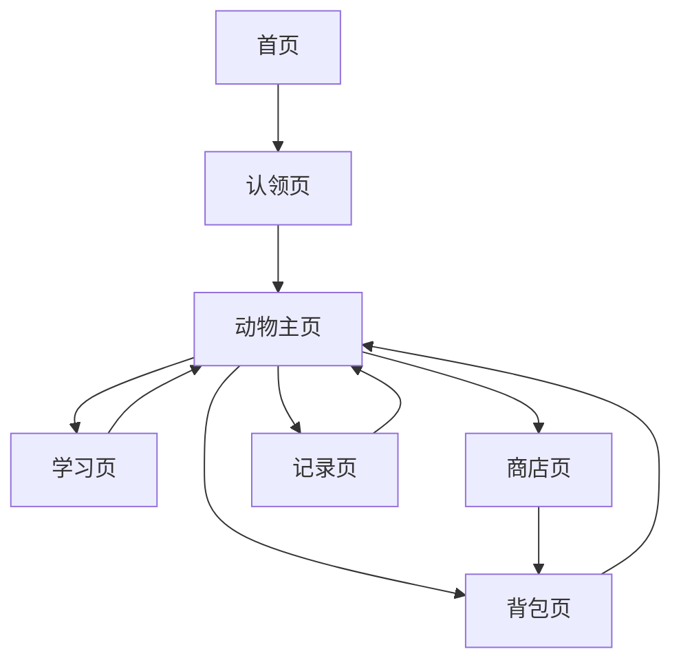
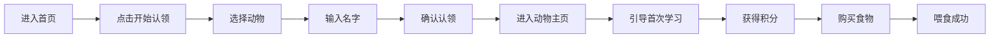
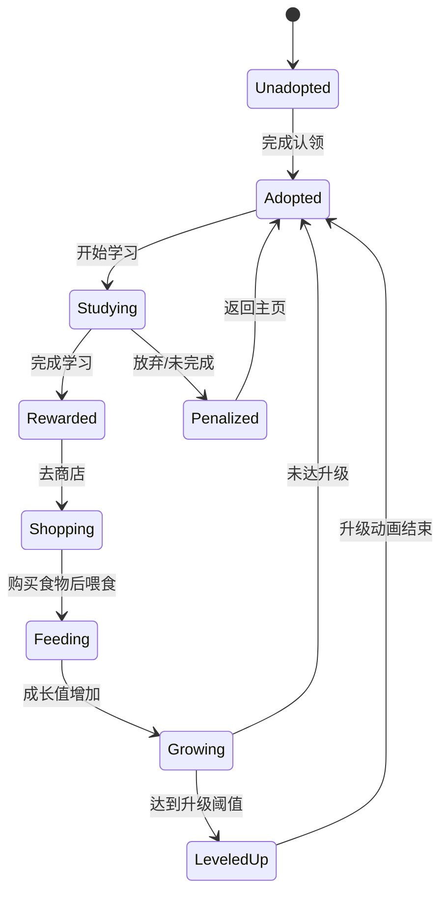

# 页面流程与状态流转

## 页面流

```mermaid
flowchart TD
  A["首页"] --> B["认领页"]
  B --> C["动物主页"]
  C --> D["学习页"]
  C --> E["商店页"]
  C --> F["背包页"]
  C --> G["记录页"]
  D --> C
  E --> F
  F --> C
  G --> C
```

## 首次引导流

```mermaid
flowchart LR
  A["进入首页"] --> B["点击开始认领"]
  B --> C["选择动物"]
  C --> D["输入名字"]
  D --> E["确认认领"]
  E --> F["进入动物主页"]
  F --> G["引导首次学习"]
  G --> H["获得积分"]
  H --> I["购买食物"]
  I --> J["喂食成功"]
```

## 核心状态机

```mermaid
stateDiagram-v2
  [*] --> Unadopted
  Unadopted --> Adopted: 完成认领
  Adopted --> Studying: 开始学习
  Studying --> Rewarded: 完成学习
  Studying --> Penalized: 放弃/未完成
  Rewarded --> Shopping: 去商店
  Shopping --> Feeding: 购买食物后喂食
  Feeding --> Growing: 成长值增加
  Penalized --> Adopted: 返回主页
  Growing --> LeveledUp: 达到升级阈值
  Growing --> Adopted: 未达升级
  LeveledUp --> Adopted: 升级动画结束
```

## 页面职责总结

- 首页：讲清玩法，负责转化
- 认领页：完成选择与命名
- 动物主页：承担全部主入口
- 学习页：产出积分
- 商店页：完成资源消费
- 背包页：将消费转化为成长
- 记录页：强化复盘与成就感
